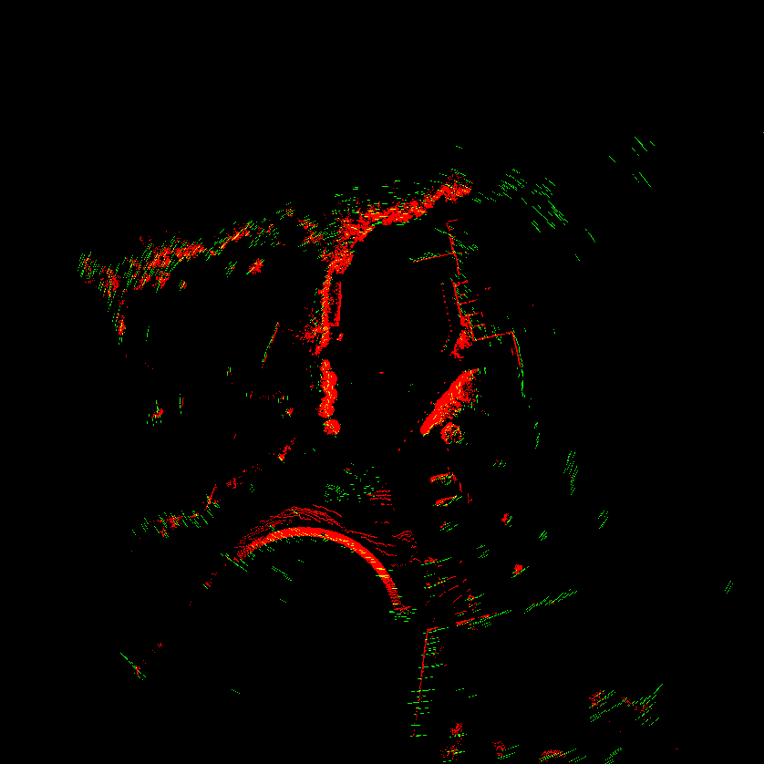

# radar_to_lidar_calib
This repository can be used to calculate the extrinsic calibration between a Navtech radar and a 3D (Velodyne) lidar. I use correlative scan matching via the Fourier Mellin transform to estimate the translation and rotation between the lidar and the radar. The image below illustrates the quality of the registration with lidar points in red and radar targets in green.

# Instructions
The robot/vehicle should be outdoors and stationary during the calibration process.

It is expected that Navtech radar data is being published as a Polar image using the format described by the [Oxford Radar Robotcar Dataset](https://oxford-robotics-institute.github.io/radar-robotcar-dataset/). This format expects that the polar image is shifted horizontally by 11 pixels such that timestamp and azimuth data are encoded in the image. The first eight pixels correspond to the UNIX timestamp as int64 (cols 0-7). Columns 8-9 encode the sweep counter as uint16, converted to angle in radians with angle = pi * sweep_counter / 2800. Column 10 represents a valid flag, which we do not use but preserve for compatibility with their format.

Collect at least one pair of radar and lidar data extracted using the extract.py script.
This script expects that your radar and lidar topics are being published in ROS.

Collecting more pairs of data in different locations will lead to a more accurate final result since we average the translation and rotation estimates over the number of pairs.

Note: this calibration is mostly useful for estimating rotation. I've verified that with 10 radar-lidar pairs, I was able to get a rotation accuracy of < 0.1 degrees. The translation estimation isn't as good, and probably isn't usable. It might be possible to upsample the cartesian image on a cropped region to get a better translation estimate, but it would be tough to beat hand measurements or a CAD model (1 cm error).

Note 2: the extract.py script uses rospy and Python 2. The calibrate.py script uses Python 3.

# Example Data
Sample data for this repository can be downloaded using the provided script: download_data.sh. The example data includes radar data from a Navtech CIR204-H and lidar data from a Velodyne Alpha-Prime (128 beam).

# References
Using the Fourier Mellin transform with radar data was previously shown in these works:

[Checchin, Paul, et al. "Radar scan matching slam using the fourier-mellin transform." Field and Service Robotics. Springer, Berlin, Heidelberg, 2010.](https://link.springer.com/chapter/10.1007/978-3-642-13408-1_14)

[Park, Yeong Sang, Young-Sik Shin, and Ayoung Kim. "PhaRaO: Direct Radar Odometry using Phase Correlation." Proceedings of the IEEE International Conference on Robotics and Automation (ICRA). IEEE. 2020.](https://irap.kaist.ac.kr/publications/yspark-2020-icra.pdf)

The Fourier Mellin transform for image registration is described in detail here:

[Reddy, B. Srinivasa, and Biswanath N. Chatterji. "An FFT-based technique for translation, rotation, and scale-invariant image registration." IEEE transactions on image processing 5.8 (1996): 1266-1271.](https://ieeexplore.ieee.org/abstract/document/506761?casa_token=WrYrcyq6NloAAAAA:T43aa6Mluef9jc69kNuK-q713zy12-pQzrf9YwQwji2B5byd06dLjTVhUaXyBuSKbnNe5vCm2ys)

## TODO:
- [ ] Remove outliers from the registration process to improve the final rotation estimate
